- [User Manual](#user-manual)
- [About](#about)
- [Versions](#versions)
- [Getting Started](#getting-started)
	- [Navigating to Site](#navigating-to-site)
	- [Create a new user](#create-a-new-user)
	- [Login/Logout](#loginlogout)
	- [Create a new graph/Open existing Graph](#create-a-new-graphopen-existing-graph)
	- [Graph Panel](#graph-panel)
	- [creating new node](#creating-new-node)
	- [edit/delete node](#editdelete-node)
	- [create new multiple Nodes and edges at same time](#create-new-multiple-nodes-and-edges-at-same-time)
	- [create new edge](#create-new-edge)
	- [delete edge](#delete-edge)
	- [entering into Child Node and Parent Node](#entering-into-child-node-and-parent-node)
	- [Save Graph](#save-graph)
	- [Undo/Redo](#undoredo)
	- [Tags \& Search (tagtype:tag)](#tags--search-tagtypetag)
	- [set node color](#set-node-color)
	- [Neighboring Model](#neighboring-model)
	- [Nested Nodes \& Global Mode](#nested-nodes--global-mode)
	- [Storing information on node/properties of node](#storing-information-on-nodeproperties-of-node)
	- [Move node/Change parent](#move-nodechange-parent)
	- [Mark nodes as same, but under different context, redirect \[incomplete\]](#mark-nodes-as-same-but-under-different-context-redirect-incomplete)
	- [Graph Sharing \[incomplete\]](#graph-sharing-incomplete)
	- [Nodes and edges - connecting node\[incomplete\]](#nodes-and-edges---connecting-nodeincomplete)
- [Developer Manual](#developer-manual)
	- [System Requirement](#system-requirement)
	- [Technology Stack](#technology-stack)
			- [Database](#database)
			- [Server side:](#server-side)
			- [FrontEnd](#frontend)
		- [Pre Requisites](#pre-requisites)
		- [Repository](#repository)
		- [Project Structure](#project-structure)
		- [Data Restore (DB)](#data-restore-db)
	- [Configuration](#configuration)
		- [Setting Up Dev Environment](#setting-up-dev-environment)
		- [Server Side Dev](#server-side-dev)
		- [Client Side Dev](#client-side-dev)
		- [Engine Dev (EventBus Architecture)](#engine-dev-eventbus-architecture)
	- [Open Dev Problems](#open-dev-problems)
- [Conceptual Model Analysis](#conceptual-model-analysis)
	- [System Definition](#system-definition)
	- [Open Conceptual Questions](#open-conceptual-questions)
	- [Event Taxonomy](#event-taxonomy)
	- [Notes & Planning](#notes--planning)


# User Manual

The software - knowledge graph represents a collection of interlinked descriptions and properties of entities – objects, events or concepts. Knowledge graph put data in context via linking and semantic metadata and this way provide a framework for data integration, unification, analytics and sharing. Simply put, software depicts ***knowledge*** in terms of entities and their relationships and facilitate self organization.


# About

Name: Knowledge Graph

Version: v 1.0.5

Intended Use: Define entities and their relationships

Access : https://graphknowledge.pheeca.com

Getting Help: To receive technical support and software assistance, please contact 	support@pheeca.com

# Getting Started


## Navigating to Site

Open website https://graphknowledge.pheeca.com in browser (Chrome, Firefox) on PC Desktop/Laptop (Not available on other devices right now)
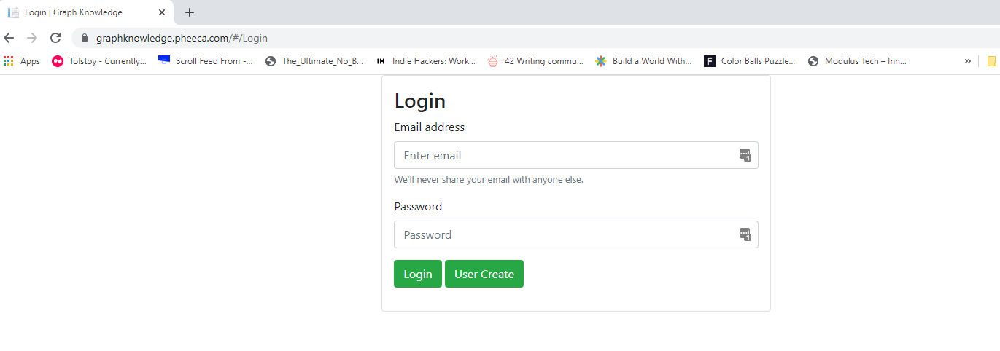


## Create a new user
If you do not already have a user, you can create it. 

1. Add Username
2. Add Password
3. Click **User Create**

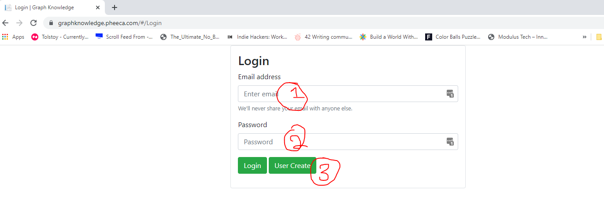

## Login/Logout

In order to login,

1. Add Username
2. Add Password
3. Click **Login**
4. Select graph

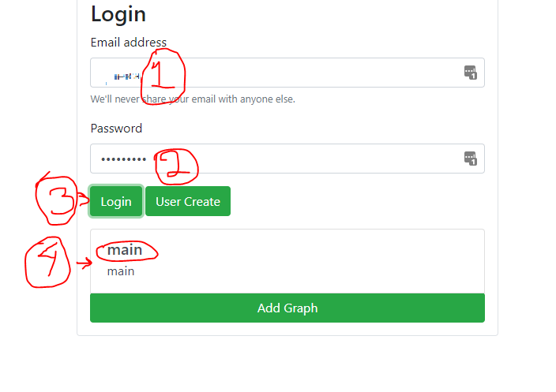

Once logged in, you can click **Logout** to signout


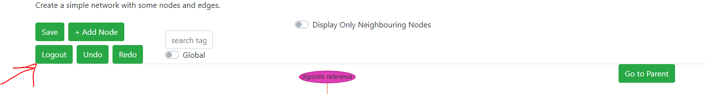

## Create a new graph/Open existing Graph
In order to open graph(after login),

1. Add Username
2. Add Password
3. Click **Login**
4. Select graph


For creating graph,

1. Add Username
2. Add Password
3. Click **Login**
4. Click **Add Graph**

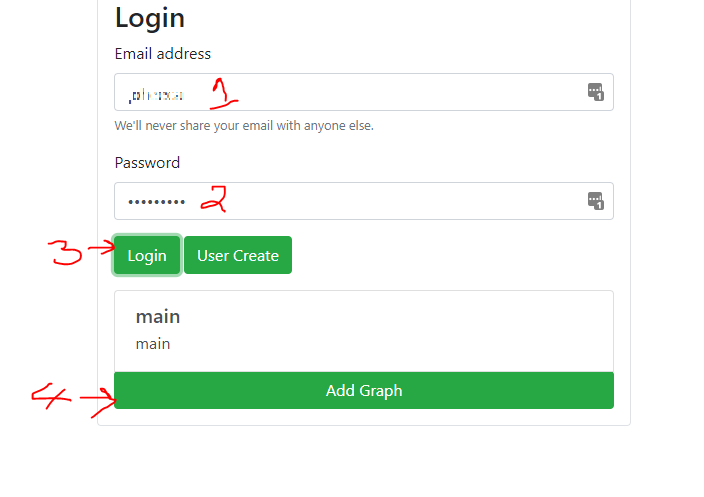

5. Add Graph Name
6. Click **Add**

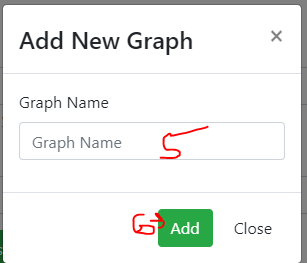

## Graph Panel

In order to zoom in and zoom out, you can click button **1** and **2** respectively. Alternatively mouse scroll button or +/- keys on keyboard can be used to zoom in/out.

Click **3** button for full-screen.

Buttons **4** to move screen right,left,top,buttom, alternatively arrow keys can be used on keyboard.

Select node (see **5** in image) by clicking on it, you can also hold it and drag. You may see selecting a node opens up a side panel.

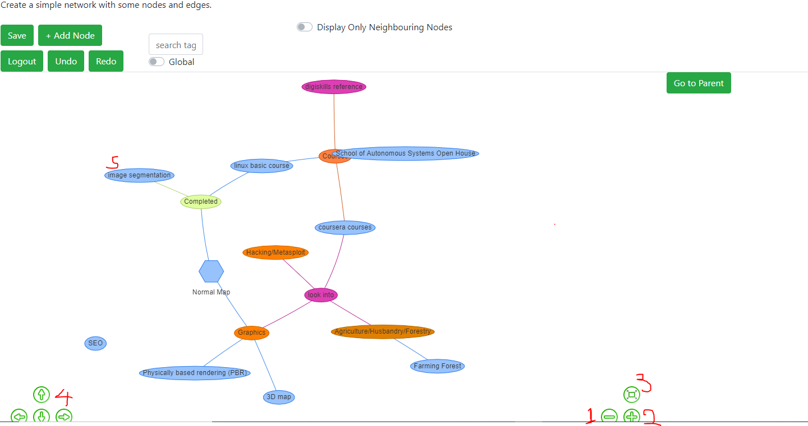
Nodes can have different shapes, colors and they can connect to each other by edge.

## creating new node
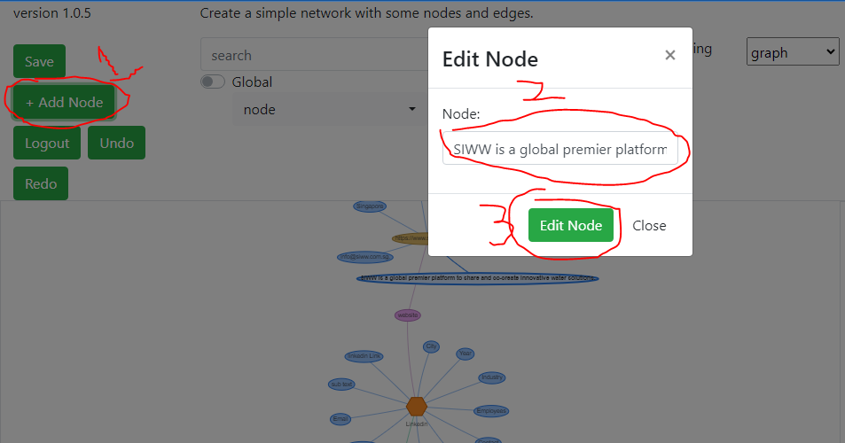
select +add button & put name of node in textbox.

1. Add Node.
2. add Node name to textbox.
3. Edit Node.

## edit/delete node
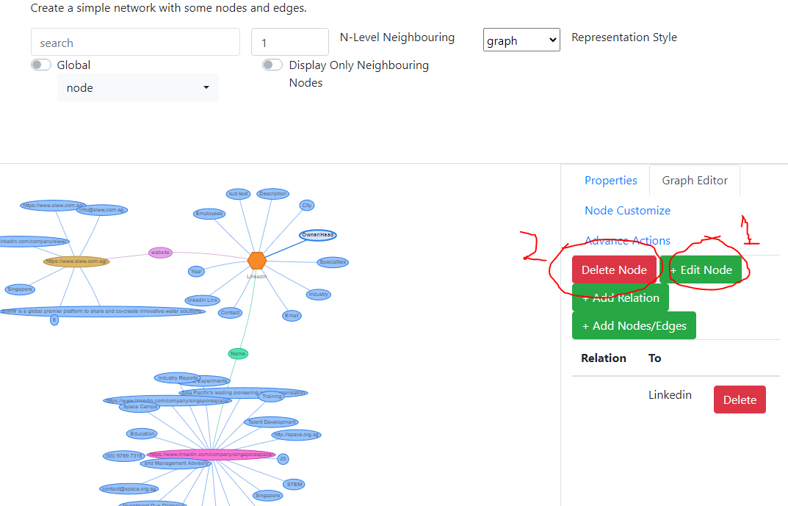
click to +edit button if you rename value or change value depend on your node name & if you delete node click to delete node button then delete your node

1. Edit button.
2. Delete node.

## create new multiple Nodes and edges at same time
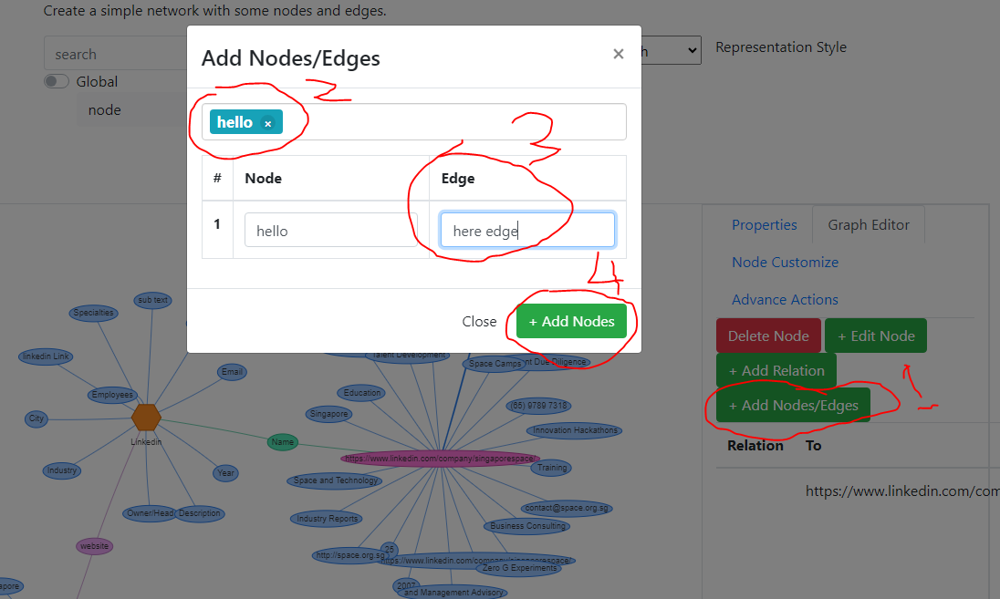
Click +Add/Edit Edge button write names of Nodes seperated by comma.

1. click add node/edge.
2. write names of Nodes seperated by comma.
3. write names of all edges on corresponding node.
4. click to below button +add node then save.


## create new edge
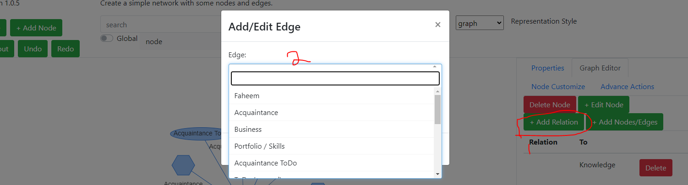
Click +Add Relations button choose Node.

## delete edge


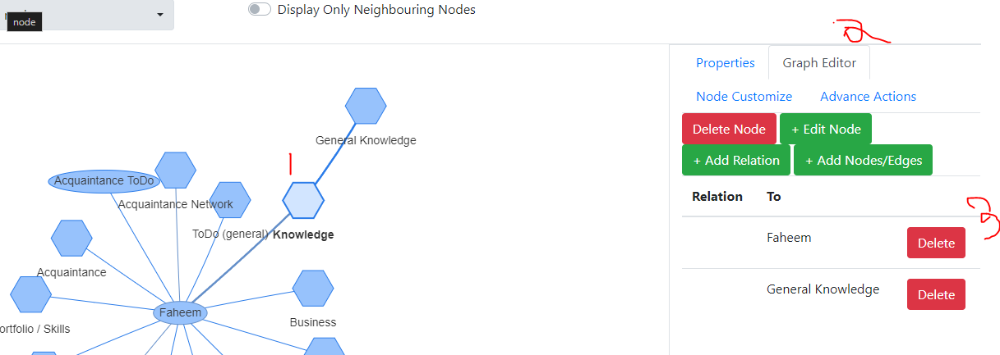
click select already created node & click delete button in relation list under graph editor.

1. select already created node.
2. find relation under graph editor.
3. delete button.


## entering into Child Node and Parent Node
select created node & double click on node & click right up side parent node button click to out side in node.

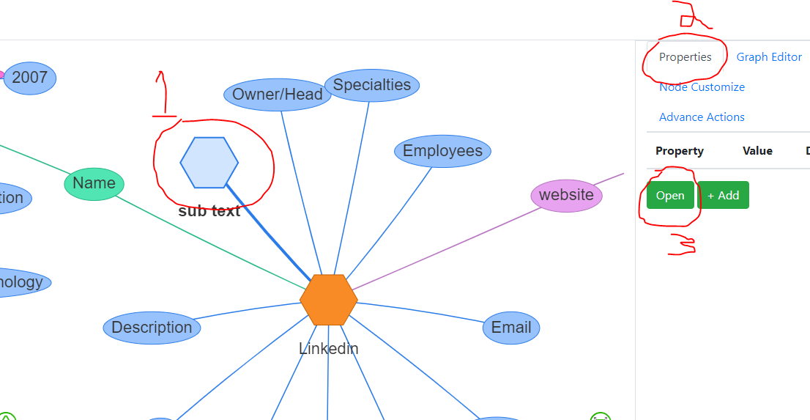

 there are two ways to enter into the child node 

1. Double click to enter in node.
the 2nd way is
1. right side bar click to property.
2. click open.

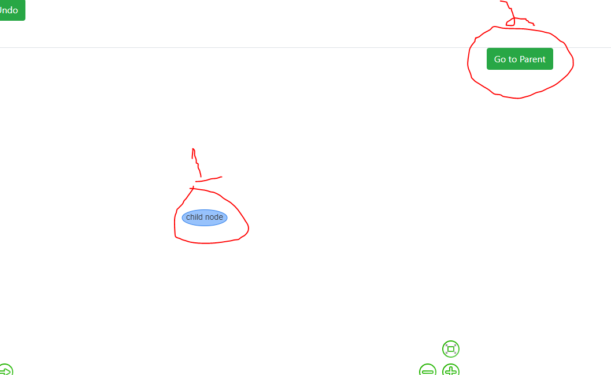

after enter to node.
1. node.
2. parent.

## Save Graph
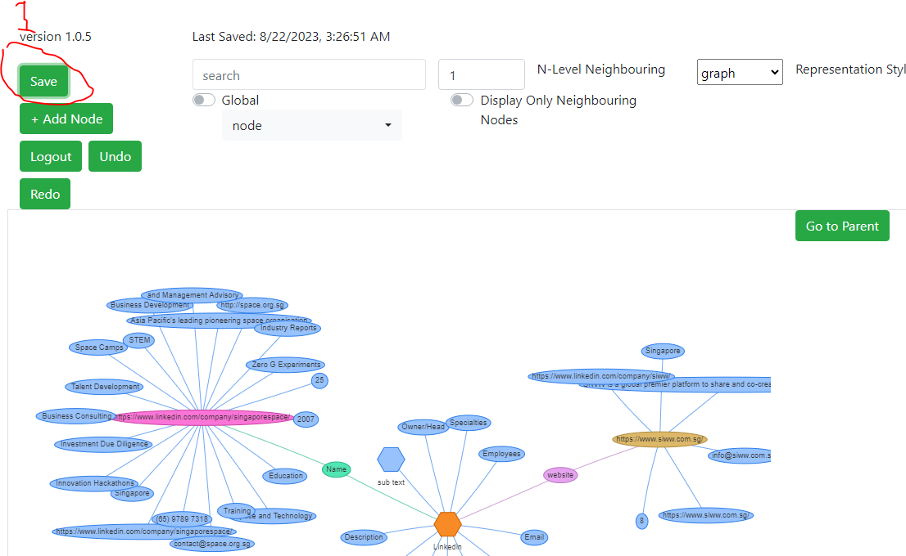
click to left up side save button & save not automaticly its manual so click save to save after every work.

1. click to save.

## Undo/Redo

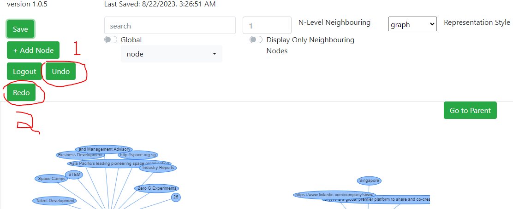
Click to undo button all work back work again return & Click Redo button work also next return.

1. click to undo.
2. click to redo.

## Tags & Search (tagtype:tag)

Used to up side search bar & put tags then search your values.
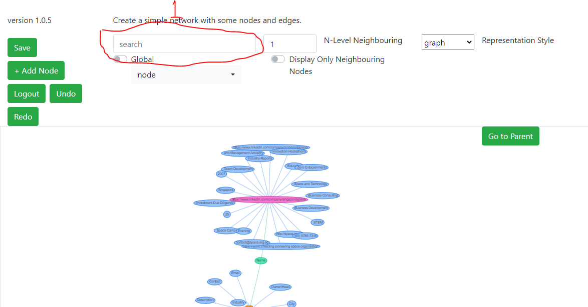

1. click to up side serach and put tag.

## set node color
Click to any already created node then see your right side click to node customize button & Select your favorite color.

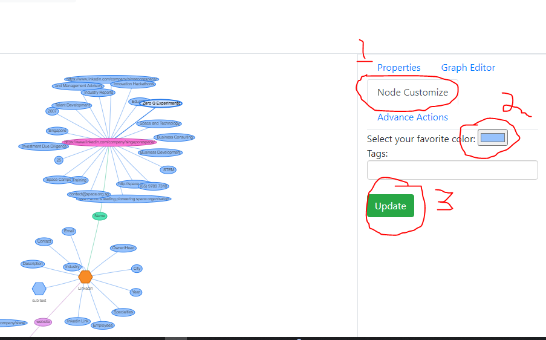

1. click to node customize.
2. click to colour then select.
3. click to update button.

## Neighboring Model
see upside circle option to click on of button Display Only Neighbouring Nodes. if you choose any number of node.

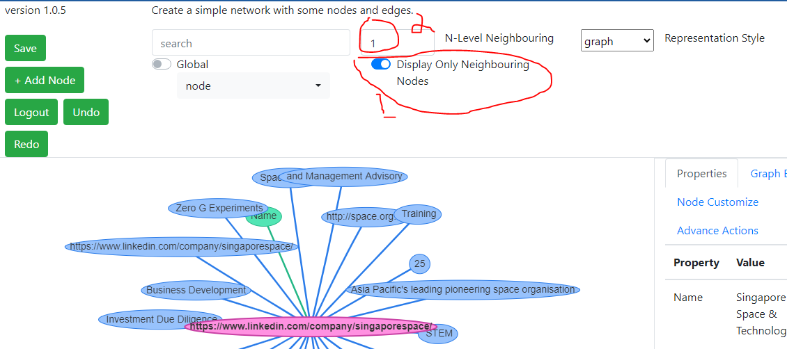

1. click to change number to node .
2. click to select on off button to explore your node.

## Nested Nodes & Global Mode
click to left upside Global button on off option click to expore your child node.

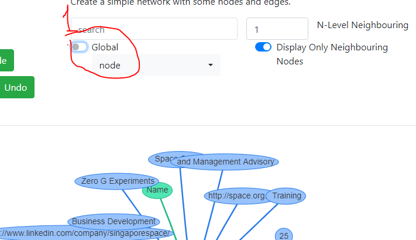

1. click to global button.

## Storing information on node/properties of node
node are simple save your information platfoum this is easy to used about your data & click to right side properties of node click to +Add button then put your values in the colum.

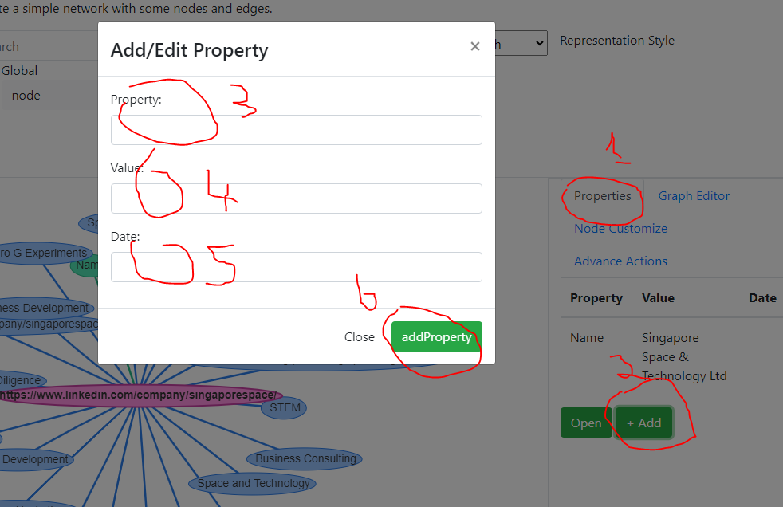


1. click Property.
2. click Add.
3. property.
4. value.
5. date.
6. add property.


## Move node/Change parent
Click' to node hold on 'click button' move to any where & click' to change parent change node location.

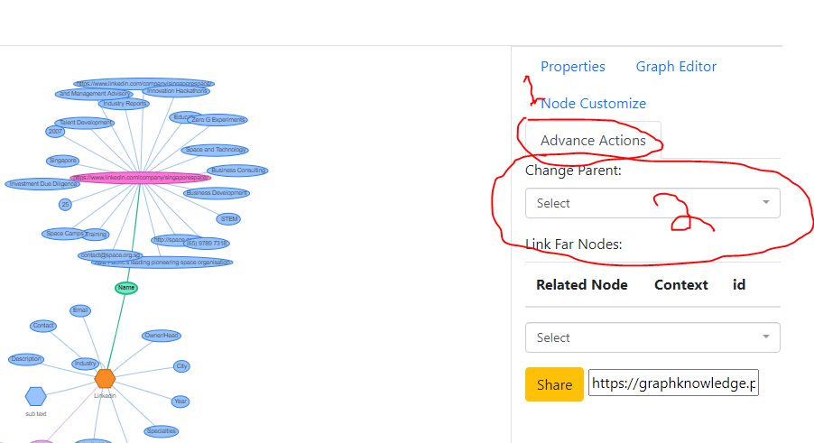

1. click to advance property button.
2. click to change parent & select your choice.


## Mark nodes as same, but under different context, redirect [incomplete]

**Purpose**  
Allows users to mark multiple nodes as representing the same entity but under different contexts. This enables redirection between such nodes, improving semantic clarity in complex graphs.

**How To Use**  
1. Double-click an already created node.  
2. Enter into that node's detail view.  
3. Select or create another node that represents the same entity in a different context.  
4. The system will link them as the same under different contexts and redirect appropriately.

**Use Case Example**  
A person node in "Project A" and the same person in "Project B" may serve different roles but represent the same individual. Use this feature to link them contextually.


## Graph Sharing [incomplete]

**Purpose**  
Allows sharing of individual nodes or graph subsets for collaboration, embedding, or referencing.

**How To Use**  
1. Click on any node.  
2. Look at the right-side bar — the **Advance Actions** section appears.  
3. Click the **share** button now visible.  
4. A unique shareable link will be generated to access that node or graph subset.

**Features**  
- Share selected nodes without exposing the full graph.  
- Supports contextual sharing with relationships preserved.  
- Links can be used in external platforms or documentation.

**Use Case Example**  
Share a knowledge node with a colleague to discuss without needing to export the full graph structure.

## Nodes and edges - connecting node[incomplete]


# Developer Manual
## System Requirement

🌐 Client Requirements

| Requirement           | Specification                            |
| --------------------- | ---------------------------------------- |
| **Browser**           | Latest versions of Chrome, Firefox, Edge |
| **JavaScript**        | Enabled                                  |
| **Screen Resolution** | 1366×768 or higher                       |

⚙️ Server Requirements

| Component            | Specification                                       |
| -------------------- | --------------------------------------------------- |
| **Operating System** | Windows, Linux, or macOS                            |
| **.NET**             | .NET 9 SDK                                          |
| **Web Server**       | Kestrel (built-in) or reverse proxy (nginx, IIS)    |
| **Database**         | SQL Server 2019+ or Azure SQL                       |
| **Disk Storage**     | Minimum 1 GB free (SSD preferred for performance)   |
| **RAM**              | Minimum 2 GB (4+ GB recommended)                    |
| **CPU**              | Dual-core (Quad-core recommended)                   |

## Technology Stack
#### Database

#### Server side:


#### FrontEnd


### Pre Requisites
- **Software/Tools**:  
  - Visual Studio 2022+ or VS Code (with C# Dev Kit)  
  - .NET 9 SDK  
  - Node.js v18+ and npm  
  - Microsoft SQL Server 2019+ (or Azure SQL Database)  
  - Git  
- **Accounts**:  
  - GitHub access for repository  
  - SQL Server credentials with read/write permissions  
- **Frameworks**:  
  - .NET 9  
  - Dapper (micro-ORM)  

### Repository
- **URL**: `https://github.com/pheeca/GraphKnowledgeManager`  
- **Branch Strategy**:  
  - `master`: Production-ready code  
  - `upgrage`: Active .NET 9 migration branch  
  - Feature branches: `feature/<feature-name>`  

### Project Structure
```plaintext
/                              # Frontend source (copied to wwwroot via npm start)
├── Scripts/                   # JS modules (app.js, services.js, graphExplorer.js, etc.)
├── Content/                   # CSS + images
├── *.tmp.html                 # Dynamic HTML templates
├── index.html                 # SPA entry point
├── package.json               # npm copy scripts
│
└── GraphKnowledgeServer/      # .NET solution root
    ├── GK.Server/             # .NET 9 Web API (active development)
    ├── GK.DataAccess/         # .NET 9 data layer (Dapper + repositories)
    ├── Database/              # SQL Server project (.sqlproj)
    ├── GraphKnowledgeServer/  # LEGACY .NET Framework API (reference only)
    ├── DataAccess/            # LEGACY EF6 data layer (reference only)
    └── EventBus/              # LEGACY SignalR hub (disabled, deferred)
```
### Data Restore (DB)

Create db in mssql and compare Database project with newly created database, transfer changes to your database

## Configuration  

Connection strings are stored as **user secrets** (never committed to the repo).

### Setting Up Dev Environment

```bash
# Clone
git clone https://github.com/pheeca/GraphKnowledgeManager

# Configure DB connection
cd GraphKnowledgeServer/GK.Server
dotnet user-secrets set "ConnectionStrings:GraphKnowledge" "<your-connection-string>"
# Or use setup-dev.cmd (Windows) / setup-dev.sh (Linux)

# Copy frontend assets to wwwroot
cd ../..     # back to repo root
npm start

# Run API server
cd GraphKnowledgeServer/GK.Server
dotnet run
```

Restore database using the SQL Server Database project in `GraphKnowledgeServer/Database/`.

### Server Side Dev
Tech Stack: .NET 9 Web API, Dapper

Key Files:
- `GK.Server/Program.cs` — DI setup, middleware pipeline
- `GK.Server/Controllers/` — API controllers
- `GK.DataAccess/` — Repository implementations (Dapper)

Debugging: Use Swagger UI (auto-enabled) or Postman to test APIs.

### Client Side Dev
Tech Stack: jQuery 3.7, Bootstrap 4, vis.js Network

Key Files:
- `Scripts/app.js` — Hash router, template loading, session management
- `Scripts/services.js` — Data service layer, in-memory graph CRUD, AJAX calls
- `Scripts/graphExplorer.js` — Node selection, property panels, graph UI
- `Scripts/utilities.js` — URL validation, deep merge helpers

Event-driven architecture via `EventBus.dispatch()` / `EventBus.addEventListener()`.

### Engine Dev (EventBus Architecture)

The system uses a custom EventBus for decoupled communication between frontend modules and (optionally) the server via SignalR.

#### Frontend Event Handling

Events are dispatched and consumed via the global `EventBus` object:

```javascript
// Dispatching an event
EventBus.dispatch('nodeCreated', data);

// Listening for an event
EventBus.addEventListener('nodeCreated', function(data) {
  // handle node creation
});
```

To propagate events to the server (when SignalR is enabled):

```javascript
messagebushub.trigger('updateGraph', data, true); // bubble=true sends to server
```

> **Note:** Events prefixed with `ui.web.` are excluded from server propagation — they stay client-side only.

#### Server Event Handling

The legacy EventBus uses a reflection-based pub-sub pattern with the `[OnEvent]` attribute:

```csharp
// Register a service with the message bus
MessageBus<object>.Instance.RegisterService(new CoreEventService());

// Service implementation — methods decorated with [OnEvent] are auto-subscribed
public class CoreEventService : IEventService
{
    [OnEvent("nodeCreated")]
    public void HandleNodeCreation(object sender, MessageBusEventArgs e)
    {
        // React to node creation
    }
}
```

The `MessageBus` scans registered services for `[OnEvent]` attributes and wires them as handlers. Events can optionally broadcast to all connected SignalR clients via `MessageBusHub`.

> **Status:** Server-side EventBus is currently **disabled** (commented out in Global.asax). Migration to .NET 9 SignalR is deferred. Frontend `EventBus` continues to work for client-side module communication.

---

## Open Dev Problems

| Problem | Description |
|---------|-------------|
| **Database versioning** | Schema evolution strategy — currently managed via SQL Server Database Project (.sqlproj) comparisons |
| **Data versioning** | Graph data versions are stored as full JSON snapshots per save. No incremental diffing or compression. |
| **Global uniform data template** | No standardized schema for node properties — each node can have arbitrary key-value pairs |
| **Multi-device support** | Currently desktop-only (Chrome, Firefox). No responsive/mobile layout. Needs sustainable approach for Mobile, Linux, macOS, iOS, Android |
| **Graph sharing & tenancy** | Sharing graphs across users/tenants/devices. Current model is single-owner per schema with no sharing mechanism |

---

# Conceptual Model Analysis

## System Definition

A complete system in this context is composed of:

> **Entities + Entity Types + Process Declaration + Scheduler + Event Engine + Reporting/Notification Engine + Prioritization Engine + Inference/Function Engine + Information Manipulation Engine = System**

Or equivalently:

> **Dynamic Event Placement Engine + Events + Actions + Information + Process Declaration + Inferencing/Estimating = System**

## Open Conceptual Questions

- How do Tenancy/User/Graphs/Devices/3rd-party data pipelines affect event highways?
- Are App Events and System Events fundamentally different, or should they share an event bus?
- How do concurrent users and the Information Manipulation Engine coordinate when editing the same graph?
- How should graph permissions and cross-user graph sharing work?

## Event Taxonomy

### App Events
Events generated by application lifecycle and user interaction:

| Scope | Events |
|-------|--------|
| **Server** | `onError`, `appStart`, `appEnd`, `requestStart` |
| **UI** | Page load, click, login, form submission |
| **Connected Device** | Access other devices' events (read-only, non-exploitable) |

### System Global Events
Events that exist independent of any specific graph or user context:

| Category | Events |
|----------|--------|
| **Login** | User login attempt (`userId`, `isSuccess`) |
| **Time Interval** | Minute, Hour, Day, Weekday/Weekend, Week, Month, Year (timezone-based) |
| **Prayer Times** | Fajr, Zuhr, Asr, Maghrib, Isha (timezone-based, on change) |
| **Sun Position** | True Dawn (−18°), Sunrise (0°), Sunset (timezone-based) |

### Contextualized Events
Events scoped to a specific graph, user, or tenant. Support filtering and time-range constraints.

| Category | Events / Capabilities |
|----------|----------------------|
| **User** | Logged in, Logged out |
| **Location** | Changed |
| **Data** | Graph created/saved/opened, node added/modified/deleted, property added/modified/deleted, undo, redo, edge added/modified/deleted (filterable by graph/user/tenant with from-to ranges) |
| **Data Pipeline** | External feeds — Twitter, Facebook, WhatsApp, News |
| **Process (Actions)** | Defined workflows triggered by events |
| **Bot** | Manual + automated actions (exact scope TBD) |
| **Prioritizer** | Event/task prioritization engine |
| **Inference** | Logical (Prolog-style) and Predictive inference |
| **Notification** | SMS, Email, Mobile Push, Device Alarm — supports absolute start/end, interval types, delayed custom triggers |
| **Dynamic Event** | Custom events filtered by graph, user, tenant, location, time (with complex scheduling: absolute, interval, delayed) |
| **Information Manipulator** | Interfaced (user-facilitated) and Non-interfaced (automatic) data transforms |
| **Reporter** | Generate reports — tabular, visual graphs; embeddable in internal/external systems (email, mobile, etc.) |

---

## Notes & Planning

### Documentation Structure Checklist

The documentation should eventually cover:

| Manual | Sections |
|--------|----------|
| **User Manual** | About, System Requirements, Navigating to Site, Getting Help, Versions |
| **User Manual — Features** | Create user, Login/Logout, Create/Open Graph, Graph Panel (drag, select, scroll, zoom), Nodes & Edges (create, edit, delete), Child/Parent navigation, Save Graph, Undo/Redo, Tags & Search, Node Color, Neighbouring Model, Nested Nodes & Global Mode, Node Properties, Move Node/Change Parent, Join nodes as same under different context (redirect), Graph Sharing |
| **Developer Manual** | System Requirements, Tech Stack, Prerequisites, Repository, Project Structure, DB Restore, Configuration, Dev Environment Setup, Server Side Dev, Client Side Dev, Engine Dev |
| **Idea Manual** | Conceptual Model Analysis, Event Taxonomy, System Definitions |

### Product Documentation Template (Reference)

Standard product documentation should include:
- Product name, model/type number
- Intended use
- Features/accessories
- Description of main product elements
- Description of user interface
- Safety warnings
- Installation instructions
- How to use/operate the product
- Troubleshooting and problem-solving
- Maintenance information
- Repair information
- Disposal of product and packaging
- Technical specifications
- Table of contents, Index, Glossary
- Warranty information
- Contact details

### Open Design Questions

- Are App Events (page load, click, login, request started, DB inserted) fundamentally different from System Events (birthdays, comments, scheduled events)?
- How should concurrent users and the Information Manipulation Engine coordinate when manipulating the same data?
- How should graph permissions and sharing with users of other graphs work?

