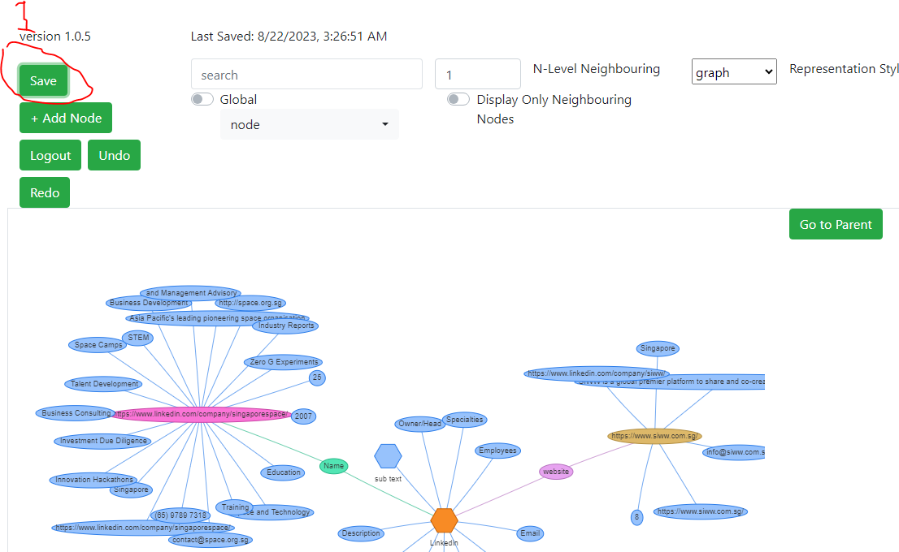
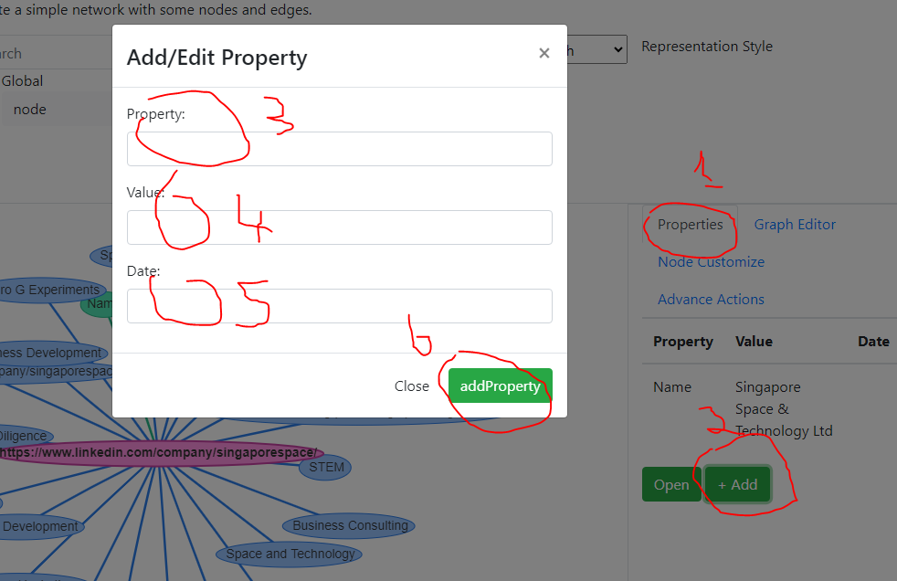

- [User Manual](#user-manual)
- [About](#about)
- [Versions](#versions)
- [Getting Started](#getting-started)
	- [Navigating to Site](#navigating-to-site)
	- [Create a new user](#create-a-new-user)
	- [Login/Logout](#loginlogout)
	- [Create a new graph/Open existing Graph](#create-a-new-graphopen-existing-graph)
	- [Graph Panel](#graph-panel)
	- [creating new node](#creating-new-node)
	- [edit/delete node](#editdelete-node)
	- [create new multiple Nodes and edges at same time](#create-new-multiple-nodes-and-edges-at-same-time)
	- [create new edge](#create-new-edge)
	- [delete edge](#delete-edge)
	- [entering into Child Node and Parent Node](#entering-into-child-node-and-parent-node)
	- [Save Graph](#save-graph)
	- [Undo/Redo](#undoredo)
	- [Tags \& Search (tagtype:tag)](#tags--search-tagtypetag)
	- [set node color](#set-node-color)
	- [Neighboring Model](#neighboring-model)
	- [Nested Nodes \& Global Mode](#nested-nodes--global-mode)
	- [Storing information on node/properties of node](#storing-information-on-nodeproperties-of-node)
	- [Move node/Change parent](#move-nodechange-parent)
	- [Mark nodes as same, but under different context, redirect \[incomplete\]](#mark-nodes-as-same-but-under-different-context-redirect-incomplete)
	- [Graph Sharing \[incomplete\]](#graph-sharing-incomplete)
	- [Nodes and edges - connecting node\[incomplete\]](#nodes-and-edges---connecting-nodeincomplete)
- [Developer Manual](#developer-manual)
	- [System Requirement](#system-requirement)
	- [Technology Stack](#technology-stack)
			- [Database](#database)
			- [Server side:](#server-side)
			- [FrontEnd](#frontend)
		- [Pre Requisites](#pre-requisites)
		- [Repository](#repository)
		- [Project Structure](#project-structure)
		- [Data Restore (DB)](#data-restore-db)
	- [Configuration](#configuration)
		- [Setting Up Dev Environment](#setting-up-dev-environment)
		- [Server Side Dev](#server-side-dev)
		- [Client Side Dev](#client-side-dev)
		- [Engine Dev \[Improper\]](#engine-dev-improper)
			- [Front End](#front-end)
			- [Server](#server)
	- [Dev Problems](#dev-problems)
- [Conceptual Model Analysis Manual](#conceptual-model-analysis-manual)
	- [Conceptual Problems](#conceptual-problems)
	- [Notes:](#notes)
	- [Switch to another file](#switch-to-another-file)
	- [Rename a file](#rename-a-file)
	- [Delete a file](#delete-a-file)
	- [Export a file](#export-a-file)
- [Synchronization](#synchronization)
	- [Open a file](#open-a-file)
	- [Save a file](#save-a-file)
	- [Synchronize a file](#synchronize-a-file)
	- [Manage file synchronization](#manage-file-synchronization)
- [Publication](#publication)
	- [Publish a File](#publish-a-file)
	- [Update a publication](#update-a-publication)
	- [Manage file publication](#manage-file-publication)
- [Markdown extensions](#markdown-extensions)
	- [SmartyPants](#smartypants)
	- [KaTeX](#katex)
	- [UML diagrams](#uml-diagrams)


# User Manual

The software - knowledge graph represents a collection of interlinked descriptions and properties of entities – objects, events or concepts. Knowledge graph put data in context via linking and semantic metadata and this way provide a framework for data integration, unification, analytics and sharing. Simply put, software depicts ***knowledge*** in terms of entities and their relationships and facilitate self organization.


# About

Name: Knowledge Graph

Version: v 1.0.0

Intended Use: Define entities and their relationships

Access : https://graphknowledge.pheeca.com

Features: 

Getting Help: To receive technical support and software assistance, please contact 	support@pheeca.com

# Versions
Version: 1.0.0	

Commit hash:	828bde1c753e6d6469f499dd020a03e4201b0098

Date: 2/5/2021 2:37:21 AM

# Getting Started


## Navigating to Site

Open website https://graphknowledge.pheeca.com in browser (Chrome, Firefox) on PC Desktop/Laptop (Not available on other devices right now)


## Create a new user
If you do not already have a user, you can create it. 

1. Add Username
2. Add Password
3. Click **User Create**


## Login/Logout

In order to login,

1. Add Username
2. Add Password
3. Click **Login**
4. Select graph


Once logged in, you can click **Logout** to signout


## Create a new graph/Open existing Graph
In order to open graph(after login),

1. Add Username
2. Add Password
3. Click **Login**
4. Select graph


For creating graph,

1. Add Username
2. Add Password
3. Click **Login**
4. Click **Add Graph**


5. Add Graph Name
6. Click **Add**


## Graph Panel

In order to zoom in and zoom out, you can click button **1** and **2** respectively. Alternatively mouse scroll button or +/- keys on keyboard can be used to zoom in/out.

Click **3** button for full-screen.

Buttons **4** to move screen right,left,top,buttom, alternatively arrow keys can be used on keyboard.

Select node (see **5** in image) by clicking on it, you can also hold it and drag. You may see selecting a node opens up a side panel.


Nodes can have different shapes, colors and they can connect to each other by edge.

## creating new node

select +add button & put name of node in textbox.

1. Add Node.
2. add Node name to textbox.
3. Edit Node.

## edit/delete node

click to +edit button if you rename value or change value depend on your node name & if you delete node click to delete node button then delete your node

1. Edit button.
2. Delete node.

## create new multiple Nodes and edges at same time

Click +Add/Edit Edge button write names of Nodes seperated by comma.

1. click add node/edge.
2. write names of Nodes seperated by comma.
3. write names of all edges on corresponding node.
4. click to below button +add node then save.


## create new edge

Click +Add Relations button choose Node.

## delete edge


click select already created node & click delete button in relation list under graph editor.

1. select already created node.
2. find relation under graph editor.
3. delete button.


## entering into Child Node and Parent Node
select created node & double click on node & click right up side parent node button click to out side in node.


 there are two ways to enter into the child node 

1. Double click to enter in node.
the 2nd way is
1. right side bar click to property.
2. click open.


after enter to node.
1. node.
2. parent.

## Save Graph

click to left up side save button & save not automaticly its manual so click save to save after every work.

1. click to save.

## Undo/Redo


Click to undo button all work back work again return & Click Redo button work also next return.

1. click to undo.
2. click to redo.

## Tags & Search (tagtype:tag)

Used to up side search bar & put tags then search your values.


1. click to up side serach and put tag.

## set node color
Click to any already created node then see your right side click to node customize button & Select your favorite color.


1. click to node customize.
2. click to colour then select.
3. click to update button.

## Neighboring Model
see upside circle option to click on of button Display Only Neighbouring Nodes. if you choose any number of node.


1. click to change number to node .
2. click to select on off button to explore your node.

## Nested Nodes & Global Mode
click to left upside Global button on off option click to expore your child node.


1. click to global button.

## Storing information on node/properties of node
node are simple save your information platfoum this is easy to used about your data & click to right side properties of node click to +Add button then put your values in the colum.




1. click Property.
2. click Add.
3. property.
4. value.
5. date.
6. add property.


## Move node/Change parent
Click' to node hold on 'click button' move to any where & click' to change parent change node location.


1. click to advance property button.
2. click to change parent & select your choice.


## Mark nodes as same, but under different context, redirect [incomplete]

**Purpose**  
Allows users to mark multiple nodes as representing the same entity but under different contexts. This enables redirection between such nodes, improving semantic clarity in complex graphs.

**How To Use**  
1. Double-click an already created node.  
2. Enter into that node's detail view.  
3. Select or create another node that represents the same entity in a different context.  
4. The system will link them as the same under different contexts and redirect appropriately.

**Use Case Example**  
A person node in "Project A" and the same person in "Project B" may serve different roles but represent the same individual. Use this feature to link them contextually.


## Graph Sharing [incomplete]

**Purpose**  
Allows sharing of individual nodes or graph subsets for collaboration, embedding, or referencing.

**How To Use**  
1. Click on any node.  
2. Look at the right-side bar — the **Advance Actions** section appears.  
3. Click the **share** button now visible.  
4. A unique shareable link will be generated to access that node or graph subset.

**Features**  
- Share selected nodes without exposing the full graph.  
- Supports contextual sharing with relationships preserved.  
- Links can be used in external platforms or documentation.

**Use Case Example**  
Share a knowledge node with a colleague to discuss without needing to export the full graph structure.

## Nodes and edges - connecting node[incomplete]


# Developer Manual
## System Requirement

🌐 Client Requirements

| Requirement           | Specification                            |
| --------------------- | ---------------------------------------- |
| **Browser**           | Latest versions of Chrome, Firefox, Edge |
| **JavaScript**        | Enabled                                  |
| **Screen Resolution** | 1366×768 or higher                       |

⚙️ Server Requirements

| Component            | Specification                                     |
| -------------------- | ------------------------------------------------- |
| **Operating System** | Windows Server 2012 R2, 2016, 2019, or newer      |
| **.NET Framework**   | .NET Framework 4.7.2 or higher                    |
| **Web Server**       | IIS 8.0 or higher (with ASP.NET role enabled)     |
| **Disk Storage**     | Minimum 1 GB free (SSD preferred for performance) |
| **RAM**              | Minimum 2 GB (4+ GB recommended)                  |
| **CPU**              | Dual-core (Quad-core recommended)                 |

## Technology Stack
#### Database

#### Server side:


#### FrontEnd


### Pre Requisites
- **Software/Tools**:  
  - Visual Studio 2019+ (with ASP.NET and web development workload)  
  - Node.js v14+ and npm  
  - Microsoft SQL Server 2018+ (or Azure SQL Database)  
  - Git  
- **Accounts**:  
  - Azure DevOps/GitHub access for repository (credentials provided by the team)  
  - SQL Server credentials with read/write permissions  
- **Frameworks**:  
  - .NET Framework 4.6.1  
  - SignalR Core  
  - Entity Framework 6+  

### Repository
- **URL**: `https://github.com/pheeca/GraphKnowledgeManager` (private repository)  
- **Branch Strategy**:  
  - `main`: Production-ready code  
  - `dev`: Active development branch  
  - Feature branches: `feature/<feature-name>`  
- **Commit Guidelines**:  
  - Follow Conventional Commits (e.g., `feat: add node creation API`).  
  - Include JIRA ticket ID in commit messages (e.g., `GK-123: Fix undo-redo bug`).  

### Project Structure
```plaintext
Solution 'GraphKnowledgeServer'  
├── DataAccess             // Database models, Entity Framework mappings  
├── Database               // SQL scripts, migrations, and backup files  
├── EventBus               // SignalR hubs, message bus implementation  
├── GraphKnowledgeServer   // MVC Web Application (UI and Controllers)  
└── Shared                 // Common utilities, DTOs, and interfaces  
```
### Data Restore (DB)

Create db in mssql and compare Database project with newly created database, transfer changes to your database

## Configuration  
Connection String: Update Web.config or appsettings.json: property "GraphKnowledgeEntities"


### Setting Up Dev Environment
Clone the repository:

```bash
git clone https://github.com/pheeca/GraphKnowledgeManager  
```
restore database (see Data Restore section)
### Server Side Dev
Tech Stack: ASP.NET MVC, WebAPI, SignalR

Key Files:

HubStartup.cs: SignalR configuration

MessageBus.cs: Event handling logic

Debugging:

Use Postman to test APIs.


### Client Side Dev
Tech Stack: jQuery, Bootstrap, HTML5 Canvas (for graph rendering)

Key Files:

graph.js: Handles node/edge interactions

main.css: Styling for graph panel and UI elements

### Engine Dev [Improper]
Front End
Event Handling:

```javascript
window.EventBus.listeners["nodeCreated"] = (data) => {  
  messagebushub.trigger("updateGraph", data);  
}; 
``` 
Integration: Use SignalR client to connect to server hubs.

Server
Event Registration:
```csharp
MessageBus<object>.Instance.RegisterService(new SampleEventService());  
```
Service Implementation:

```csharp
public class CoreEventService : IEventService {  
    [OnEvent("nodeCreated")]  
    public void HandleNodeCreation(EventContext context) {  
        // Logic here  
    }  
}  
```

#### Front End
window.EventBus.listeners
messagebushub.trigger

#### Server
MessageBus<object>.Instance.RegisterService
SampleEventService,CoreEventService
OnEvent


## Dev Problems
Database versioning

Data versioning

Global Uniform data template?

sustainable way to Support multiple OS/Devices (Mobile, Linux, MacOS, iOS, Android)

Sharing Graph wrt (Tenancy/USer/Graphs/Devices)

# Conceptual Model Analysis Manual


-DEF 1
Entities+EntityTypes+Process Declaration+Scheduler+Event Engine+Reporting/Notification Engine+Prioritization Engine+Inference/Function Engine+Information Manupulation Engine= System

-DEF 2
dynamic event placement engine+events+actions+information+process declaration+inferencing/estimating all these 


## Conceptual Problems
how Tenancy/USer/Graphs/Devices/3rd party data pipelines affect event highways?

App events(page load,click,login,request started,DB inserted) different than System Events (birthdays, comments,scheduled events etc)?
APP
   Server
		onerror
		appstart
		append
		requeststart
   UI
   ConnectedDevice (access other devices's events-but not hackable)
SystemGlobal
	Login
		user logged in attempt(user id,isSuccess)
	TimeInterval
		Minute
		Hour (timezone based)
		Day (timezone based)
		Weekday,Weekend,Week,Month,year
		NamazTimeChange (timezone based)
			Fajr
			Zuhr
			Asr
			Maghrib
			Isha
		Sun (timezone based)
			True Dawn (-18 degrees)
			Sun rise (0 degree)
			Sun Set
Contextualized (wrt graph,user,tenant)
	User
		Loggedin
		Loggedout
	Location
		changed
	Data(with filter+from-to)
	 graph created,graph saved,graph opened,node added, node modified,node deleted, property added,property modified,property deleted,undo,redo,(link node?),edge added,edge modified,edge deleted etc
	DataPipeline
		Twitter/FB (fb/whatsapp/twitter/news)
	Process (Actions)
	Bot(??? Not sure,manual + automated)
	Prioritizer
	Inference
		Logical (prolog)
		Predictive
	Notify(including absoltue start end,interval type,interval start end,interval delayed custom point)
		SMS
		email
		Mobile Notification
		Device Alarm
	DynamicEvent 
		custom (filter by graph,user,tenant,Location,Time[including from-to;including absoltue start end,interval type,interval start end,interval delayed custom point])
	Information manipulator
		  interfaced(user facilitated)
		  non interfaced(automatic)
	Reporter
		Generate Reports (tabular,visual graphs; embeded in systems internal and external systems email,mobile,etc)

concurrent user/Information Manupulation Engine manipulating info?

Graph Permission/share with user of other graph?

-------------
## Notes:

documentation

USer manual

Developer Manual

Idea manual


Product name
Model or type number
Intended use
Features/accessories
Description of the main product elements
Description of the user interface
Safety warnings
Installation instructions
Description of how to use/operate the product
Troubleshooting section and instructions on how to solve problems
Maintenance information
Repair information
Information on disposal of the product and packaging
Technical specifications
Table of content
Index
Glossary
Warranty information
Contact details

-----------------------
user manual
-About
-SysRequirement
-How to open website
-Getting Help
-Versions
--Create a new user
--Login/Logout
--Create a new graph/Open existing Graph
--Graph Panel - drag Nodes,select node/edge, scroll up/down/right/left, Zoom in-out
--Nodes and edges - connecting node, create new node, edit/delete node, create new edge,edit/delete edge
--entering into Child Node and Parent Node
--Save Graph 
--Undo/ReDo
--Tags & Search (tagtype:tag)
--set node color
--Neighbouring Model
--Nested Nodes & Global Mode
--Storing information on node/properties of node
--Move node/Change parent
--Join nodes as same under different context, redirect
--GraphShareing


https://stackedit.io/app#


The file explorer is accessible using the button in left corner of the navigation bar. You can create a new file by clicking the **New file** button in the file explorer. You can also create folders by clicking the **New folder** button.

## Switch to another file

All your files and folders are presented as a tree in the file explorer. You can switch from one to another by clicking a file in the tree.

## Rename a file

You can rename the current file by clicking the file name in the navigation bar or by clicking the **Rename** button in the file explorer.

## Delete a file

You can delete the current file by clicking the **Remove** button in the file explorer. The file will be moved into the **Trash** folder and automatically deleted after 7 days of inactivity.

## Export a file

You can export the current file by clicking **Export to disk** in the menu. You can choose to export the file as plain Markdown, as HTML using a Handlebars template or as a PDF.


# Synchronization

Synchronization is one of the biggest features of StackEdit. It enables you to synchronize any file in your workspace with other files stored in your **Google Drive**, your **Dropbox** and your **GitHub** accounts. This allows you to keep writing on other devices, collaborate with people you share the file with, integrate easily into your workflow... The synchronization mechanism takes place every minute in the background, downloading, merging, and uploading file modifications.

There are two types of synchronization and they can complement each other:

- The workspace synchronization will sync all your files, folders and settings automatically. This will allow you to fetch your workspace on any other device.
	> To start syncing your workspace, just sign in with Google in the menu.

- The file synchronization will keep one file of the workspace synced with one or multiple files in **Google Drive**, **Dropbox** or **GitHub**.
	> Before starting to sync files, you must link an account in the **Synchronize** sub-menu.

## Open a file

You can open a file from **Google Drive**, **Dropbox** or **GitHub** by opening the **Synchronize** sub-menu and clicking **Open from**. Once opened in the workspace, any modification in the file will be automatically synced.

## Save a file

You can save any file of the workspace to **Google Drive**, **Dropbox** or **GitHub** by opening the **Synchronize** sub-menu and clicking **Save on**. Even if a file in the workspace is already synced, you can save it to another location. StackEdit can sync one file with multiple locations and accounts.

## Synchronize a file

Once your file is linked to a synchronized location, StackEdit will periodically synchronize it by downloading/uploading any modification. A merge will be performed if necessary and conflicts will be resolved.

If you just have modified your file and you want to force syncing, click the **Synchronize now** button in the navigation bar.

> **Note:** The **Synchronize now** button is disabled if you have no file to synchronize.

## Manage file synchronization

Since one file can be synced with multiple locations, you can list and manage synchronized locations by clicking **File synchronization** in the **Synchronize** sub-menu. This allows you to list and remove synchronized locations that are linked to your file.


# Publication

Publishing in StackEdit makes it simple for you to publish online your files. Once you're happy with a file, you can publish it to different hosting platforms like **Blogger**, **Dropbox**, **Gist**, **GitHub**, **Google Drive**, **WordPress** and **Zendesk**. With [Handlebars templates](http://handlebarsjs.com/), you have full control over what you export.

> Before starting to publish, you must link an account in the **Publish** sub-menu.

## Publish a File

You can publish your file by opening the **Publish** sub-menu and by clicking **Publish to**. For some locations, you can choose between the following formats:

- Markdown: publish the Markdown text on a website that can interpret it (**GitHub** for instance),
- HTML: publish the file converted to HTML via a Handlebars template (on a blog for example).

## Update a publication

After publishing, StackEdit keeps your file linked to that publication which makes it easy for you to re-publish it. Once you have modified your file and you want to update your publication, click on the **Publish now** button in the navigation bar.

> **Note:** The **Publish now** button is disabled if your file has not been published yet.

## Manage file publication

Since one file can be published to multiple locations, you can list and manage publish locations by clicking **File publication** in the **Publish** sub-menu. This allows you to list and remove publication locations that are linked to your file.


# Markdown extensions

StackEdit extends the standard Markdown syntax by adding extra **Markdown extensions**, providing you with some nice features.

> **ProTip:** You can disable any **Markdown extension** in the **File properties** dialog.


## SmartyPants

SmartyPants converts ASCII punctuation characters into "smart" typographic punctuation HTML entities. For example:

|                |ASCII                          |HTML                         |
|----------------|-------------------------------|-----------------------------|
|Single backticks|`'Isn't this fun?'`            |'Isn't this fun?'            |
|Quotes          |`"Isn't this fun?"`            |"Isn't this fun?"            |
|Dashes          |`-- is en-dash, --- is em-dash`|-- is en-dash, --- is em-dash|


## KaTeX

You can render LaTeX mathematical expressions using [KaTeX](https://khan.github.io/KaTeX/):

The *Gamma function* satisfying $\Gamma(n) = (n-1)!\quad\forall n\in\mathbb N$ is via the Euler integral

$$
\Gamma(z) = \int_0^\infty t^{z-1}e^{-t}dt\,.
$$

> You can find more information about **LaTeX** mathematical expressions [here](http://meta.math.stackexchange.com/questions/5020/mathjax-basic-tutorial-and-quick-reference).


## UML diagrams

You can render UML diagrams using [Mermaid](https://mermaidjs.github.io/). For example, this will produce a sequence diagram:


And this will produce a flow chart:


